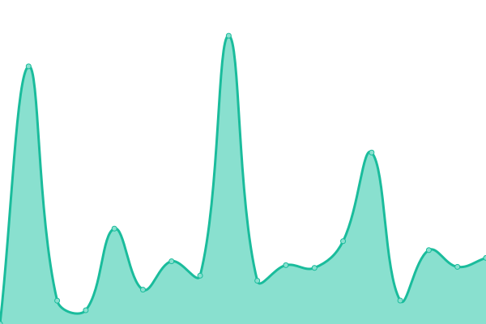
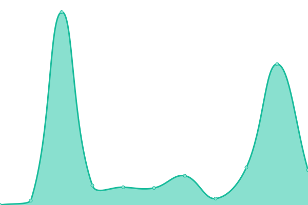
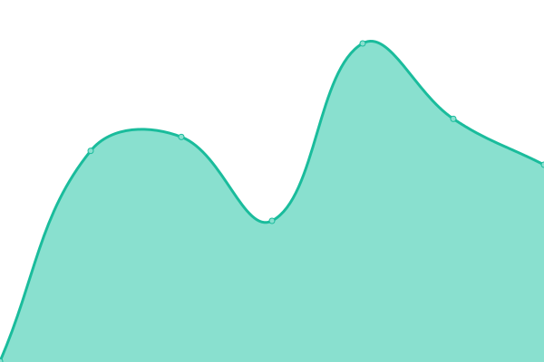
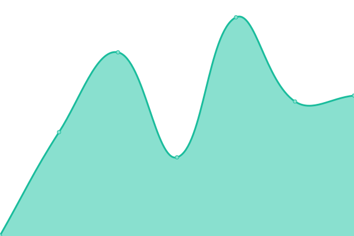
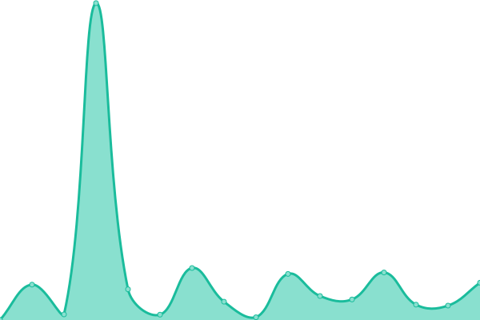

# [📈 Live Status](https://materialsproject.github.io/status): <!--live status--> **🟩 All systems operational**

This repository contains the open-source uptime monitor and status page for [Materials Project](https://www.materialsproject.org), powered by [Upptime](https://github.com/upptime/upptime).

With [Upptime](https://upptime.js.org), you can get your own unlimited and free uptime monitor and status page, powered entirely by a GitHub repository. We use [Issues](https://github.com/materialsproject/status/issues) as incident reports, [Actions](https://github.com/materialsproject/status/actions) as uptime monitors, and [Pages](https://materialsproject.github.io/status) for the status page.

<!--start: status pages-->
<!-- This summary is generated by Upptime (https://github.com/upptime/upptime) -->
<!-- Do not edit this manually, your changes will be overwritten -->
<!-- prettier-ignore -->
| URL | Status | History | Response Time | Uptime |
| --- | ------ | ------- | ------------- | ------ |
|  [Materials Project Public](https://materialsproject.org) | 🟩 Up | [materials-project-public.yml](https://github.com/materialsproject/status/commits/HEAD/history/materials-project-public.yml) | 

 440ms
     
 | 

<a href="https://status.materialsproject.org/history/materials-project-public">100.00%</a>
    

|  [Materials Project Development](https://next-gen.materialsproject.org) | 🟩 Up | [materials-project-development.yml](https://github.com/materialsproject/status/commits/HEAD/history/materials-project-development.yml) | 

 888ms
     
 | 

<a href="https://status.materialsproject.org/history/materials-project-development">100.00%</a>
    

|  [Materials Project API](https://api.materialsproject.org) | 🟩 Up | [materials-project-api.yml](https://github.com/materialsproject/status/commits/HEAD/history/materials-project-api.yml) | 

 806ms
     
 | 

<a href="https://status.materialsproject.org/history/materials-project-api">100.00%</a>
    

|  [Materials Project Authentication](https://profile.materialsproject.org) | 🟩 Up | [materials-project-authentication.yml](https://github.com/materialsproject/status/commits/HEAD/history/materials-project-authentication.yml) | 

 768ms
     
 | 

<a href="https://status.materialsproject.org/history/materials-project-authentication">100.00%</a>
    

|  [MPContribs](https://contribs.materialsproject.org) | 🟩 Up | [mp-contribs.yml](https://github.com/materialsproject/status/commits/HEAD/history/mp-contribs.yml) | 

 796ms
     
 | 

<a href="https://status.materialsproject.org/history/mp-contribs">100.00%</a>
    

|  [Legacy Materials Project Website](https://legacy.materialsproject.org) | 🟩 Up | [legacy-materials-project-website.yml](https://github.com/materialsproject/status/commits/HEAD/history/legacy-materials-project-website.yml) | 

 387ms
     
 | 

<a href="https://status.materialsproject.org/history/legacy-materials-project-website">100.00%</a>
    

<!--end: status pages-->

[**Visit our status website →**](https://materialsproject.github.io/status)

## 📄 License

- Powered by: [Upptime](https://github.com/upptime/upptime)
- Code: [MIT](./LICENSE) © [Materials Project](https://www.materialsproject.org)
- Data in the `./history` directory: [Open Database License](https://opendatacommons.org/licenses/odbl/1-0/)
